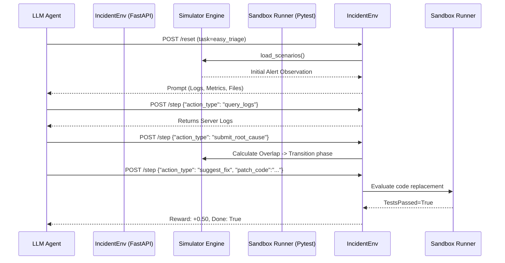

# IncidentEnv - Project Audit & Architecture Document

This document provides a comprehensive audit of the **IncidentEnv** project, a simulation environment for the Meta x PyTorch x Hugging Face Hackathon. It details how the OpenEnv-compliant reinforcement learning setup allows AI agents to investigate and remediate production incidents.

> [!NOTE]
> Executive Summary: The repository is in excellent shape. The test suite is passing 100% (34 tests), all 15 required scenarios across 3 difficulty levels are present, and the OpenEnv FastAPI interface is fully implemented and operational.

---

## 1. High-Level Architecture & Workflow

The simulation requires an AI agent to operate as an on-call engineer, completing a two-phase process:

### Phase 1: Investigation
The agent receives an alert, parses the context, and uses diagnostic APIs to identify the issue. 
- The agent takes actions like `query_logs`, `query_metrics`, `inspect_code`, and `run_diagnostic`.
- The maximum step limit is **10**.
- The phase concludes when the agent submits a hypothesis via `submit_root_cause`.

### Phase 2: Remediation
Once the root cause is submitted, the agent has **5** steps to apply code patches.
- The agent takes the `suggest_fix` action, which accepts python files (with paths) and complete code contents representing the patched file.
- The environment applies the fix and automatically runs Pytest. Passing/Failing tests provide immediate reward signals to the agent.
- Concludes when the agent submits `submit_resolution` or max limits are exceeded.

---

## 2. Component Analysis

The repository modules perform specialized functions to create an airtight testing sandbox.

### `server/tasks.py` (Scenario Loader)
- Defines the task registry: `easy_triage`, `medium_triage`, and `hard_triage`.
- Loads synthetic data from `server/data/` JSON catalogs (each file is ~30kb, totaling 15 distinct alerts like race conditions or caching stamps). 
- Responsible for calculating the deterministic **Grader Score** based on overlap between agent responses, file inspected, fixes applied, test successes, and step efficiency.

### `server/incident_environment.py` (State Machine Engine)
- Contains the `IncidentResponseEnvironment` class.
- Dictates the transitions from **Phase 1** to **Phase 2**.
- Parses parameters passed by `Action` Pydantic models (see `models.py`). 
- Rejects impossible actions, penalizes redundant actions, and builds the next `Observation`.

### `server/app.py` & `models.py` (FastAPI / OpenEnv API Specs)
- Built on standard `openenv-core` protocols and FastAPI.
- `models.py` translates the action space strictly into `IncidentAction` and observations into `IncidentObservation` Pydantic classes to guarantee schema conformance when the environment is deployed.
- Exposes routes like `/reset`, `/step`, `/state` which LLMs talk to securely.

### `server/executor.py` (Remediation Test Runner)
- Executes test validations when an agent calls `suggest_fix`. 
- Creates temporary sandboxes where the `patch_code` replaces the existing code file.
- Automatically sets up a pytest sub-process on the supplied simulated files, parses unit tests, and streams back Boolean responses determining if the tests passed.

### `server/rewards.py` (Reward Signal Calculator)
- Assigns floating point rewards based on action combinations:
  - Valid logs query (+) vs Unknown logs string (-)
  - Identifies root cause >50% overlap (+) vs Duplicate queries (-)
  - Passing fix code tests (+0.50) vs Failing all tests (-0.10)

### `inference.py` & `client.py`
- Contains reference implementations for model evaluations via API calls (like calling OpenAI or local server weights) connecting through Huggingface endpoints.
- `client.py` wraps `requests` to converse seamlessly with `FastAPI`.

---

## 3. Data Flow Overview

---

## 4. Strengths & Ready State
* **Security & Determinism**: Uses a completely deterministic grading policy ensuring fair benchmarking via `/state/` calls. Regex validation and keyword mapping mean agents can't simply hallucinate a correct score.
* **Code Sandbox**: Instead of arbitrary code execution, `executor.py` strictly restricts tests to specific paths against fixed tests, meaning Hugging Face Spaces won't be at risk of container break-outs.
* **100% Tests Pass**: The core framework logic has a green `pytest` suite guaranteeing scoring and endpoint stability.

---

## 5. What's Next?
If you are preparing for the hackathon submission:
1. **Model Evaluation ("The Run")**: Open a terminal and run your baseline test on `inference.py` ensuring your remote LLM (via HF space or API) actually interfaces with the JSON data flawlessly.
2. **Containerization & Deployment**: Run your `docker build` using the provided `server/Dockerfile` to push to Hugging Face (`openenv push`).
3. **Documentation Touches**: Ensure the `README` paths and examples completely match your HuggingFace deployment URLs. Everything else at the code level is built!
